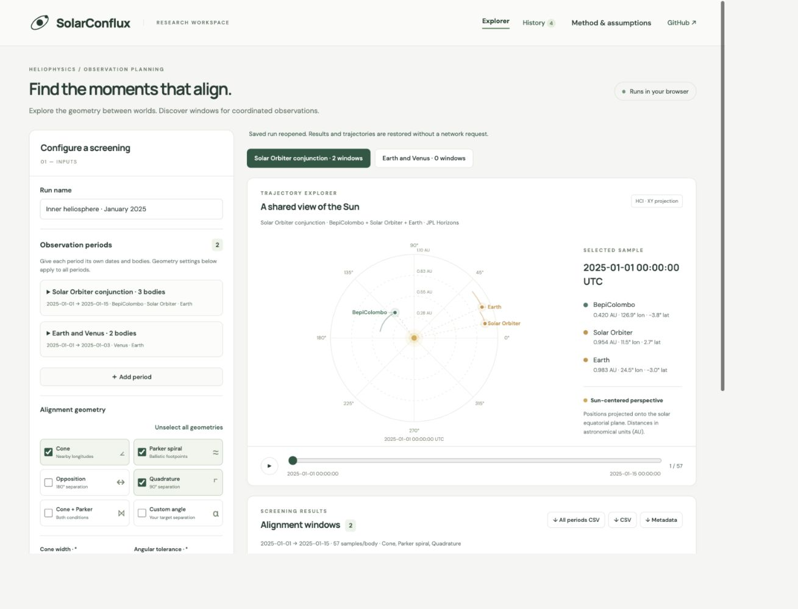

# 🛰️ SolarConflux

<p>
  <a href="https://github.com/EmmaVellard/SolarConflux/actions/workflows/tests.yml">
    
  </a>
  
  
  
</p>

**SolarConflux** is a Python research tool for screening heliocentric spacecraft and planetary ephemerides for approximate geometric and Parker-spiral alignments relevant to coordinated solar observations.

It is designed for transparent scientific screening: clear inputs, explicit assumptions, reproducible CSV outputs, run metadata, and lightweight polar plots.

> SolarConflux is intended for observation-planning support and exploratory scientific analysis. It is not a full heliospheric MHD model and should not be used as a validated connectivity model without further scientific review.

## Browser GUI

Plan and screen observations directly in the page. Choose **JPL Horizons · retrieve live**, select bodies and dates, then click **Retrieve & screen**. Trajectories appear in the explorer automatically—no generated command or manual transfer is needed.



- Select from all **17 supported bodies**, with the Sun available as the reference origin.
- Add up to **eight periods**, each with its own dates, cadence and body selection. Geometry settings apply across the run.
- Screen all six alignment modes, or use **Unselect all geometries** to start a new selection.
- Inspect trajectories with persistent body captions, play through samples, and jump to alignment windows.
- Download individual-period CSV/metadata or one CSV covering all periods.
- Reopen previous runs from **History**, including their trajectories, settings and results. Download a complete run backup, or delete a run with an undo option.


History is stored in this browser on this device. Clearing site data removes it; different site addresses have separate histories. Save a run download when you need a portable record. The bundled January 2025 example and local trajectory JSON imports also work without live retrieval.

### Run locally

After installing SolarConflux and its dependencies:

```sh
python scripts/build_web.py
python -m solarconflux.server --port 8765
```

Open `http://127.0.0.1:8765/`. The first screening downloads the pinned browser Python runtime. Calculations use the same Python engine as the CLI.

**GitHub Pages hosts the interface; live retrieval needs a separately hosted Python service.** JPL does not support browser cross-origin requests. The included service retrieves and transforms ephemerides; the page screens them and keeps your run history locally. See [GUI usage](docs/web_gui.md), [service and Pages deployment](deploy/README.md), and the [integrity/usability audit](docs/integrity_usability_audit.md). Deployment files are included; this does not imply that a public instance is already deployed.

Created by **Emma Vellard**.

## Scientific Motivation

SolarConflux helps identify time intervals when spacecraft and planetary bodies occupy geometries that may be useful for coordinated solar and heliospheric observations.

These configurations can support first-pass studies of solar wind propagation, multi-spacecraft context, and observation opportunities involving missions and bodies such as Solar Orbiter, Parker Solar Probe, BepiColombo, STEREO-A, JUICE, Earth, Venus, Mars, and Jupiter.

The goal is not to replace detailed heliospheric modeling, but to provide a transparent screening tool for finding potentially interesting time windows.

## Features

- Fetch spacecraft and planetary ephemerides through SunPy, Astropy, Astroquery, and JPL Horizons.
- Transform trajectories to a heliocentric frame for alignment screening.
- Detect approximate opposition, quadrature, cone, arbitrary-angle, Parker spiral, and cone-Parker configurations.
- Handle circular longitude comparisons, including 0/360 degree wraparound cases.
- Optionally require matched bodies to remain within a simple heliographic latitude span.
- Save event CSV files with stable column names.
- Save `run_metadata.json` files describing inputs, assumptions, Horizons identifiers, and generated outputs.
- Generate optional polar plots for quick visual inspection.
- Run from either a command-line interface or a Python workflow.
- Include offline synthetic tests for geometry behavior.

## Documentation

Additional documentation:

- [Scientific validation and assumptions](docs/scientific_validation.md)
- [Parker spiral convention](docs/parker_spiral_convention.md)
- [Release plan](docs/release_plan.md)
- [Example workflow: Earth and Solar Orbiter](case_studies/examples/earth_solar_orbiter_2025/README.md)
- [Validation case: Solar Orbiter and BepiColombo](case_studies/validation/solar_orbiter_bepicolombo/README.md)
- [Changelog](CHANGELOG.md)

## Installation

From a local checkout:

```bash
git clone https://github.com/EmmaVellard/SolarConflux.git
cd SolarConflux
python -m pip install .
```

SolarConflux requires Python 3.9 or later.

Runtime dependencies include:

- NumPy
- Matplotlib
- Astropy
- SunPy
- Astroquery

Trajectory retrieval requires network access and valid coverage from JPL Horizons.

## CLI Quickstart

Interactive mode:

```bash
solarconflux --interactive
```

Reproducible non-interactive run:

```bash
solarconflux \
  --bodies Earth,Venus,"Solar Orbiter" \
  --start-time "2025-01-01" \
  --end-time "2025-03-01" \
  --step 60m \
  --geometries opposition,quadrature,cone \
  --cone-width 10 \
  --tolerance 10 \
  --latitude-tolerance 5 \
  --output-dir results \
  --save-plots \
  --verbose
```

Parker spiral screening:

```bash
solarconflux \
  --bodies Earth,"Solar Orbiter" \
  --start-time "2025-01-01" \
  --end-time "2025-02-01" \
  --step 60m \
  --geometries parker,coneparker \
  --solar-wind-speed 400 \
  --output-dir results \
  --save-plots
```

Arbitrary-angle screening:

```bash
solarconflux \
  --bodies Earth,Venus,Mars \
  --start-time "2025-01-01" \
  --end-time "2025-03-01" \
  --step 60m \
  --geometries arbitrary \
  --arbitrary-angle 30 \
  --tolerance 10 \
  --output-dir results
```

CLI angle options are given in degrees. Solar wind speed is given in km/s.

## Python Quickstart

```python
from solarconflux import get_trajectories, matching_dates, save_match

body_list = ["Earth", "Venus", "Solar Orbiter"]

trajectories = get_trajectories(
    body_list,
    "2025-01-01",
    "2025-03-01",
    "60m",
)

matches = matching_dates(
    ["cone", "opposition", "quadrature", "arbitrary"],
    body_list,
    trajectories,
    cone_width=10,
    tolerance=10,
    latitude_tolerance_deg=5,
    arbitrary_angle=30,
    angle_unit="deg",
)

save_match(matches, "results")
```

Public angle inputs default to degrees. The lower-level geometry implementation uses radians internally.

## Example Workflow

A reproducible example is provided in:

```text
case_studies/examples/earth_solar_orbiter_2025/
```

This example screens approximate geometric and Parker-spiral alignments between Earth and Solar Orbiter in January 2025.

To run it from the repository root:

```bash
bash case_studies/examples/earth_solar_orbiter_2025/command.sh
```

The example demonstrates CLI usage, trajectory retrieval, cone alignment screening, Parker spiral screening, optional latitude filtering, CSV export, metadata export, and optional polar plot generation.

Outputs are written to:

```text
case_studies/examples/earth_solar_orbiter_2025/outputs/
```

The example depends on live JPL Horizons trajectory retrieval, so it requires internet access and valid ephemeris coverage for the selected bodies and dates.

## Method Summary

For each selected body and time step, SolarConflux retrieves ephemerides and represents trajectories in a heliocentric spherical frame. The tool then screens candidate time windows using circular angular separation in heliolongitude.

Parker spiral modes use a simplified ballistic backmapping approximation from the body longitude to an estimated source-surface footpoint longitude:

```text
phi_source = phi_body + omega_sun * (r_body - r_source_surface) / u_sw
```

where:

- `phi_source` is the estimated source-surface footpoint longitude.
- `phi_body` is the heliolongitude of the body.
- `omega_sun` is the assumed solar rotation rate.
- `r_body` is the heliocentric distance of the body.
- `r_source_surface` is the assumed source-surface radius.
- `u_sw` is the solar wind speed.

Default Parker spiral assumptions currently include:

- Solar rotation period: 25.38 days.
- Source-surface radius: 2.5 solar radii.
- Parker footpoint tolerance: 5 degrees.
- Default solar wind speed: 400 km/s.

## Supported Geometries

| Geometry | Description | Main parameters |
| --- | --- | --- |
| `opposition` | Heliolongitude separation close to 180 degrees | `--tolerance` |
| `quadrature` | Heliolongitude separation close to 90 degrees | `--tolerance` |
| `cone` | Bodies located within a configurable longitude sector | `--cone-width` |
| `arbitrary` | Heliolongitude separation close to a user-defined angle | `--arbitrary-angle`, `--tolerance` |
| `parker` | Approximate Parker spiral footpoint longitude matching | `--solar-wind-speed`, `--tolerance` |
| `coneparker` | Combined cone and Parker spiral screening | `--cone-width`, `--solar-wind-speed`, `--tolerance` |

Both Parker modes pair a footpoint-longitude test against a fixed 5 degree Parker tolerance
with a latitude test that uses `--tolerance`. Widening `--tolerance` to loosen `opposition`
therefore also loosens the latitude requirement in Parker modes. This is separate from
`--latitude-tolerance`, which filters the whole matched group afterwards.

Screening compares at least two bodies other than the Sun, which is the coordinate origin and
carries no observing longitude. A run naming fewer than two such bodies is rejected rather
than reported as "no matches".

Longitude comparisons use circular angular separation. This means that values near 0 and 360 degrees are treated correctly.

For `quadrature`, the tool uses unsigned circular separation. A 270 degree oriented configuration is therefore treated as equivalent to a 90 degree separation.

For `arbitrary`, angles greater than 180 degrees are interpreted through their equivalent smaller circular separation.

## Optional Latitude Filtering

By default, SolarConflux applies no additional latitude filter.

Set `--latitude-tolerance` in the CLI, or `latitude_tolerance_deg` in Python, to require each candidate group to satisfy:

```text
max(latitude_deg) - min(latitude_deg) <= latitude_tolerance_deg
```

For two bodies, this is equivalent to:

```text
abs(lat1_deg - lat2_deg) <= latitude_tolerance_deg
```

This latitude filter is a simple heliographic proximity screen applied after the longitude-based geometry criterion. It does not change the Parker spiral approximation, source-surface assumptions, solar wind speed handling, or longitude-based geometry definitions.

## Supported Bodies

SolarConflux currently includes metadata for the following bodies:

- BepiColombo
- Solar Orbiter
- PSP
- Stereo-A
- Juice
- Europa Clipper
- Maven
- Messenger
- Juno
- SDO
- SOHO
- ACE
- Venus
- Earth
- Mars
- Jupiter
- Sun

Availability depends on JPL Horizons coverage for the selected body and date range. Some spacecraft have limited valid time windows.

Run `solarconflux --list-bodies` to see each body's Horizons ID, its date range, and whether SPICE kernels are available for it.

## Ephemeris Sources

Trajectories can come from either of two backends, selected with `--source` on the CLI or
`source=` in `get_trajectories`:

| Source | Behaviour |
| --- | --- |
| `horizons` (default) | Queries JPL Horizons over the network. Covers every supported body. |
| `spice` | Reads local SPICE kernels, downloaded on demand and cached. Works offline once cached, and is unaffected by Horizons rate limits. Fails if any requested body has no kernels. |
| `prefer-spice` | Uses SPICE for each body that has kernels and Horizons for the rest. Lets a period mix bodies such as PSP or ACE, which have no usable SPK, with bodies that do. |

Under `prefer-spice`, a body whose kernels reach only part of the window is retried against
Horizons and the more complete series is kept. SOHO is the case that matters: its archived SPK
stops in 2014 while Horizons still covers it, so preferring SPICE never costs samples the
other backend would have supplied.

All three return positions in the Heliocentric Inertial frame via the same SunPy transform,
so results are directly comparable.

Under `prefer-spice` the backend used for each body is recorded in `body_sources` in the
exported bundle and in the run metadata, so a mixed run states which body came from where
rather than leaving it ambiguous.

### Kernel cache

SPICE kernels are downloaded on first use into `~/.solarconflux/kernels`, or the directory
named by `SOLARCONFLUX_KERNEL_DIR`. Only the files overlapping the requested interval are
fetched, so a short run over one week does not pull an entire mission. Install the extra
dependency with:

```bash
pip install "solarconflux[spice]"
```

### SPICE coverage limits

SPICE cannot cover every body that Horizons does. The backend fails with an explicit message
rather than returning a substitute:

- **ACE** and **SDO** have no public SPK at all — their ephemerides are published as
  SSCWeb/CDAWeb orbit data. Use `--source horizons` for these.
- **Solar Orbiter** and **PSP** kernels are not mirrored by NAIF. The ESA SPICE Service and
  APL hosts are attempted, but neither path could be verified during development, so treat
  them as best effort. If a fetch fails, drop a `.bsp` into the cache directory for that body
  and it will be used. `prefer-spice` falls back to Horizons for these automatically.
- **Stereo-A** kernels at NAIF stop at 2018-12-31, are predicted rather than reconstructed
  after 2015-01-01, and differ from Horizons by a few thousand km (~26 arcsec). Prefer
  `--source horizons` when that matters.
- **SOHO** kernels stop at 2014-12-01 and have a real gap from 1998-08-19 to 1998-09-25.
- **Mars** and **Jupiter** are read from their system barycentres, because the generic
  `de440s.bsp` carries no body centre for either. The offset is ~0.2 m for Mars and ~230 km
  for Jupiter, far below the resolution of this screening.

### Missions that do not span the whole period

A body whose ephemeris starts or ends inside the requested window no longer fails the run.
It contributes the part that is covered, and takes no part in the geometry outside it, so an
alignment involving that body ends when its coverage does. A body with no coverage at all in
the window is left out and the rest of the run proceeds.

Every adjustment is reported rather than applied silently, on the CLI's standard output
regardless of `--verbose`, in `coverage_notes` in the exported bundle, in the run metadata, and
in the GUI feedback line:

```
Messenger: truncated: kept 2015-04-28 00:00 to 2015-04-30 00:00, the part within its SPICE coverage
PSP: excluded: outside its ephemeris coverage, which starts 2018-08-12 08:16 TDB
```

If the window covers none of the requested bodies, the run fails and names the reason for each
one, rather than reporting an empty result.

Horizons refuses a request that runs past a mission's ephemeris instead of returning the
covered part, but it names the boundary, so the query is retried against the samples inside
it. SPICE coverage is read directly from the kernels. Bodies may therefore have different
sample counts, though they all stay on the same cadence and sample grid so they remain
directly comparable.

### Comparing the two backends

`scripts/compare_sources.py` reports the residuals between the backends and exits non-zero
if any body falls outside tolerance:

```bash
python scripts/compare_sources.py --bodies Earth,Venus,Mars --start-time 2025-01-01 \
    --end-time 2025-01-05 --step 1d
```

Measured agreement is at the metre level for planets and for spacecraft whose archived
kernels are the same product Horizons serves (BepiColombo, Juice, Europa Clipper, Juno,
Maven, SOHO): longitude residuals of order 1e-5 arcsec. Stereo-A is the one body where the
public archive genuinely differs from Horizons.

## Outputs

SolarConflux writes outputs into a date-derived folder inside the selected output directory.

Example:

```text
results/
└── 2025-01-01_to_2025-03-01/
    ├── 2025-01-01_to_2025-03-01.csv
    ├── run_metadata.json
    └── *.png
```

If no matches are found, SolarConflux still writes a header-only CSV file so automated workflows have a predictable artifact.

Rows are ordered by start time, then geometry, then bodies, so `event_id` depends only on the
detected events and not on the order `--geometries` was given in. The same run screened through
the browser GUI numbers its events identically.

CSV files use a stable column order:

| Column | Description |
| --- | --- |
| `event_id` | Event identifier within the output file |
| `start_time` | Start time of the detected event |
| `end_time` | End time of the detected event |
| `duration_hours` | Event duration in hours |
| `duration_days` | Event duration in days |
| `geometry` | Geometry mode that produced the event |
| `bodies` | Bodies involved in the event |
| `number_of_bodies` | Number of bodies in the event |
| `latitude_tolerance_deg` | Latitude tolerance used, if any |
| `latitude_span_deg` | Latitude span of the event, if available |
| `tolerance_deg` | Angular tolerance used |
| `cone_width_deg` | Cone width used |
| `arbitrary_angle_deg` | Arbitrary angle used, if any |
| `solar_wind_speed_km_s` | Solar wind speed used for Parker modes |

`run_metadata.json` records the SolarConflux package version, input parameters, selected bodies, Horizons identifiers, generated output filenames, and main assumptions.

When `--save-plots` is used, SolarConflux saves polar plots for quick visual inspection. These plots are intended for exploratory analysis and may require manual refinement before use in publication-quality figures.

## Scientific Assumptions and Limitations

SolarConflux is an approximate geometry and connectivity screening tool.

Important assumptions:

- Coordinates are compared in a heliocentric spherical frame after trajectory retrieval.
- Opposition, quadrature, cone, and arbitrary-angle modes compare heliolongitude only.
- All longitude comparisons use circular angular separation.
- Optional latitude filtering uses a simple maximum-minus-minimum latitude span in degrees.
- Parker spiral matching uses a ballistic source-surface footpoint approximation.
- Latitude matching in Parker modes uses a simple latitude tolerance, not a field-line or plasma model.

Known limitations:

- SolarConflux is not a full heliospheric MHD model.
- Horizons queries require network access.
- Horizons coverage depends on the selected body and date range.
- Event detection assumes compatible time sampling across all selected trajectories.
- Optional latitude filtering requires finite latitude values for all bodies in a candidate group.
- Parker spiral behavior should receive scientific review before publication-quality interpretation.
- The Parker spiral sign convention, solar rotation convention, source-surface radius, and latitude treatment should be validated for the intended scientific application.
- Plots are intended for inspection and may need refinement for publications.

## Testing

Run the offline test suite:

```bash
python -m unittest discover -s tests
```

If `pytest` is installed, the same tests can also be run with:

```bash
pytest
```

The offline tests use synthetic trajectories and do not require live Horizons access.

The current test suite includes checks for CLI help behavior, longitude wraparound near 0 and 360 degrees, opposition detection, cone detection, arbitrary-angle detection, optional latitude filtering, CSV export, and metadata export behavior.

Live Horizons checks should be treated separately because they depend on network access and external ephemeris availability.

Network-dependent tests are skipped unless explicitly enabled. They cover live Horizons
retrieval and the SPICE-versus-Horizons cross-check, and the SPICE ones download kernels on
first run:

```bash
SOLARCONFLUX_RUN_INTEGRATION=1 pytest tests/test_integration_horizons.py tests/test_integration_spice.py
```

## Roadmap

Planned improvements include:

- Validate live Horizons retrieval across all supported bodies and date ranges.
- Expand the example gallery with additional validated spacecraft configurations.
- Add continuous integration for automated testing.
- Add more detailed scientific validation notes for Parker spiral assumptions.
- Review Parker spiral sign convention and source-surface assumptions with domain experts.
- Improve packaging metadata for research software distribution.
- Add optional controls for plot format and plot density.

## Citation

If you use SolarConflux in research, reports, presentations, or derived software, please cite the repository using the metadata provided in [`CITATION.cff`](CITATION.cff).

GitHub should display a **“Cite this repository”** button in the sidebar when the `CITATION.cff` file is present.

Suggested citation:

```text
Vellard, E. SolarConflux: Heliocentric geometry and Parker-spiral alignment screening for coordinated solar observations. GitHub repository: https://github.com/EmmaVellard/SolarConflux
```

A DOI may be added later by archiving a release through Zenodo or another research software archive.

## References

Scientific and software context relevant to SolarConflux includes:

- Parker, E. N. (1958). Dynamics of the interplanetary gas and magnetic fields. The Astrophysical Journal.
- JPL Horizons documentation.
- SunPy documentation.
- Astropy documentation.
- Astroquery documentation.

## Credits

Author: Emma Vellard

SolarConflux was developed as a research tool for studying coordinated solar observations using spacecraft and planetary alignments.

## License

SolarConflux is distributed under the MIT License. See `LICENSE` for details.
