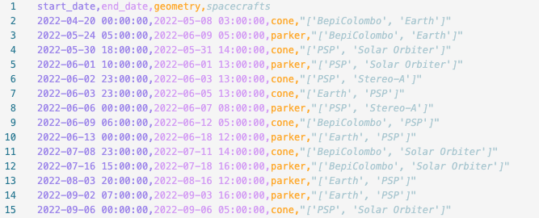

<h1 align="center">🛰️ SolarConflux 🛰️</h1>

## Overview

**SolarConflux** is a Python module for retrieving and analyzing the trajectories of multiple spacecraft and planets in the heliocentric reference frame. It detects specific geometric alignments between bodies, such as opposition, quadrature, Parker spiral, and more — valuable for planning coordinated solar observations or contextualizing space weather events.

---

## 🔭 Geometries Definition

SolarConflux supports the detection of the following geometric alignments:

- **Opposition**: One spacecraft or planet is on the opposite side of the Sun from another, forming a object1-Sun–object2 alignment with an angle ≈ 180°.
  
- **Quadrature**: The angle between two objects as seen from the Sun is ≈ 90°, corresponding to a perpendicular configuration.
  
- **Cone**: Two or more spacecraft lie within a 10° angular separation as seen from the Sun. 

- **Arbitrary**: Allows for custom angle detection between any pair of objects as seen from the Sun, useful for specific science use cases (e.g., partial alignments).

- **Parker Spiral**: Alignment based on the expected parker spiral trajectory of the solar wind originating from a source region of the Sun.

- **Cone Parker**: Combinaison of the Cone and Parker alignements. 

---

## 🚀 Main Features

1. **Trajectory Retrieval**: Fetches ephemerides from JPL Horizons using SunPy/Astropy.
2. **Coordinate Transformation**: Converts to the Heliocentric Inertial (HCI) frame.
3. **Alignment Detection**: Finds alignments between any combination of objects.
4. **Customizable Parameters**: Set custom angles and solar wind speeds.
5. **Export & Visualization**: Save results in `.csv` and visualize them in polar plots.

---

## 🧩 Modules Used

- `SunPy` / `Astropy` / `Astroquery`: For coordinate handling and trajectory querying.
- `Matplotlib`: For trajectory plotting in polar view.
- `CSV` / `OS`: For saving and managing output data.

---

## 📥 Inputs

- A list of spacecraft and/or planets.
- Time range and time step for analysis.
- Geometrical configuration(s) to detect.
- Optional parameters:
  - Arbitrary angle (for `arbitrary` mode, in deg).
  - Solar wind speed (for `parker` mode, in km/s).

## 📤 Outputs

- A `.csv` file listing all detected alignment times and involved bodies.
- Polar plots showing spacecraft trajectories and relative positions.

---

## 🛠️ Installation

```bash
pip install git+https://github.com/EmmaVellard/SolarConflux.git
```

---

## 🧪 Usage

To launch SolarConflux interactively:

```python
from solarconflux import SolarConflux
SolarConflux()
```

---

## 🧵 Example

```python
from solarconflux import get_trajectories, matching_dates, save_match, save_plot

# Define bodies
body_list = ['BepiColombo', 'Solar Orbiter', 'PSP', 'Stereo-A', 'Earth', 'Mars', 'Jupiter']

# Time window
start_time = '2020-09-01 09:00'
end_time = '2020-12-31 23:00'
step = '60m'

# Get trajectories
trajectories = get_trajectories(body_list, start_time, end_time, step)

# Define alignment types
geometry_choices = ['cone', 'opposition', 'quadrature', 'arbitrary', 'parker', 'coneparker']

# Parameters
arbitrary_angle = 30  # degrees
u_sw = 400e3          # solar wind speed in m/s

# Detect alignments
match = matching_dates(geometry_choices, body_list, trajectories,
                       arbitrary_angle=arbitrary_angle, u_sw=u_sw)

# Save results
save_match(match)
save_plot(match, trajectories)
```
---

## 🖼️ Example Outputs

After running the example script, SolarConflux generates the following outputs:

### CSV Output

<p align="center">
  
</p>

A `.csv` file containing timestamps and spacecraft involved in detected alignments.


### Cone Alignment Plot

<p align="center">
  
</p>

Visualization of a **cone alignment** where multiple spacecraft lie within a narrow angular sector as seen from the Sun.


### Parker Spiral Alignment Plot

<p align="center">
  
</p>

Representation of a **Parker spiral alignment**, showing spacecraft aligned along the solar wind’s expected trajectory.


## 🧑‍🚀 Credits

**Author**: Emma Vellard  
SolarConflux was developed as part of a research tool for studying coordinated solar observations using spacecraft alignments.  
If you use this tool in your work, please consider citing the repository or mentioning the author.

**License**: This project is licensed under the [MIT License](LICENSE).
